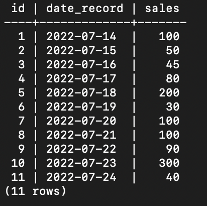
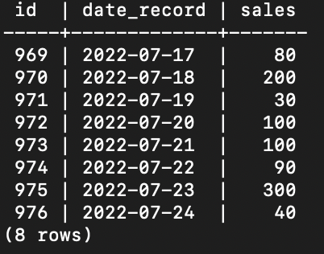

# Glints - Data Engineer Technical Assessment

Submit by: Rio Rizki Aryanto, at July 24, 2022

This repo contains submission files regarding the technical assessment of data engineer from Glints. Goal of this assessment is to create a pipeline to be able to migrate data from specific PostgreSQL database to another database using Airflow with Docker.
To accomodate that, the processes was separated into two which is preprocessing and migrating as the main process. 
In brief, preprocessing is a stage to prepare everything before doing the main migrating process.

## Preprocessing
In this repo there are two different dump files from local PostgreSQL representing the sources (Database X) and targets (Database Y).
The local database was set up with username named **postgres** and username **rajapokemon**.

You can restore these two databases or just simply create two different dabases with named **sources** and **targets**.
Using those dumps files mean that we don't need to prepared the dummy table for the main process later, but if we decided to create the databases from scratch, there is already a DAG file in airflow to generate the dummy table. 

After we have the database, the next step is to run the docker-compose.

### ----------

Basically, the previous two databaes contain exactly same table named **sales_record**. The table stored daily number of sales and has 3 columns *id*, *date_record* and *sales*.
In this case, I assume **sources** or Database X as the master database, while **targets** or Database Y is the temporary database to be used for another specific case such as data visualization, data analysis, etc.
Another assumption that I made in this case is database **targets** will only contains the data last 7 days from **sources** database. So, the migration process will only move the data from **sources** database within the last 7 days.

Table **sales_record** will looks like below

## Migration

To run this repo, first you need to run the docker-compose.yaml file. Below are the steps to run the migration process from **sources** to **targets** database.
1. Run command docker-compose up. This command should be run in terminal inside the directory of the repo. This command will run the airflow-webserver inside the docker. 
2. Access the airflow-webserver in http://localhost:5884/
3. Log in using username **airflow** and password **airflow**
4. There are two DAG named **postgres_operator** and **postgres_migration** 
5. First, execute DAG named **postgres_operator**. This script will generate table **sales_record** in both **sources** and **targets** database. This also generate dummy data in for the table inside **sources** database
6. Skip the previous step if we already used the dump files provided before
7. Lastly, just need to execute **postgres_migration** to move the last 7-days from table **sales_record** in **sources** database to table with exactly same name but stored in **targets** database
8. If run successfully, we will get the table below

